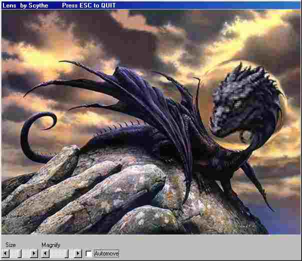

<div align="center">

## Lens \(Update 1\)


</div>

### Description

Creates a Lens effect like u know from some demos or the windows screensavers. think this is the fastest way to do this in VB. Runs smooth on my 333MHz PC. NEW Lens Calculation is faster (thx to Carles P.V.) and some errors fixed (Thx to Robert Rayment)
 
### More Info
 


<span>             |<span>
---                |---
**Submitted On**   |2002-09-07 16:56:52
**By**             |[Scythe](https://github.com/Planet-Source-Code/PSCIndex/blob/master/ByAuthor/scythe.md)
**Level**          |Intermediate
**User Rating**    |4.9 (59 globes from 12 users)
**Compatibility**  |VB 5\.0, VB 6\.0
**Category**       |[Graphics](https://github.com/Planet-Source-Code/PSCIndex/blob/master/ByCategory/graphics__1-46.md)
**World**          |[Visual Basic](https://github.com/Planet-Source-Code/PSCIndex/blob/master/ByWorld/visual-basic.md)
**Archive File**   |[Lens\_\(Upda1302829122002\.zip](https://github.com/Planet-Source-Code/scythe-lens-update-1__1-38749/archive/master.zip)

### API Declarations

```
Private Declare Function GetDIBits Lib "gdi32" (ByVal aHDC As Long, ByVal hBitmap As Long, ByVal nStartScan As Long, ByVal nNumScans As Long, lpBits As Any, lpBI As BITMAPINFO, ByVal wUsage As Long) As Long
Private Declare Function SetDIBits Lib "gdi32" (ByVal hdc As Long, ByVal hBitmap As Long, ByVal nStartScan As Long, ByVal nNumScans As Long, lpBits As Any, lpBI As BITMAPINFO, ByVal wUsage As Long) As Long
Private Declare Sub CopyMemory Lib "kernel32" Alias "RtlMoveMemory" (Destination As Any, Source As Any, ByVal Length As Long)
```


